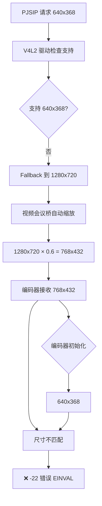

# Fix 100.32：使用摄像头硬件支持的 640x480 @ 30fps 分辨率

**时间**: 2026-01-11 03:30
**问题**: Fix 100.29-100.31 失败，V4L2 不支持非标准分辨率 640x368
**根本原因**: V4L2 驱动不支持自定义分辨率，fallback 到 1280x720 → 视频会议桥缩放 → 编码器尺寸不匹配

## 问题根因链



## 摄像头硬件支持的分辨率

**设备**: icspring camera (/dev/video1)
**原生格式**: MJPG（V4L2 自动转换为 I420）

| 分辨率 | 帧率 | 16像素对齐 | 宽高比 | 适用性 |
|--------|------|------------|--------|--------|
| 640x480 | 30fps | ✅ 640=16×40, 480=16×30 | 4:3 | ⭐⭐⭐ 推荐 |
| 1280x720 | 30fps | ✅ 1280=16×80, 720=16×45 | 16:9 | ⭐⭐ 备选 |
| 800x600 | 30fps | ❌ 600≠16倍数 | 4:3 | ❌ 不可用 |
| 1920x1080 | 30fps | ❌ 1080≠16倍数 | 16:9 | ❌ 不可用 |

**选择**: 640x480 @ 30fps（VGA 标准分辨率）

**理由**:
1. ✅ 100% 硬件支持（VGA 标准）
2. ✅ 完美 16 像素对齐（h264_rkmpp 要求）
3. ✅ 数据量小，性能最佳
4. ✅ 接近原目标 640x368
5. ❌ 4:3 宽高比（非理想，但可接受）

## 修改内容

### 1. risipendpoint.cpp

**Line 796-799**: 编码器初始化格式
```cpp
pjmedia_format_init_video(&h264_param.enc_fmt,
                         PJMEDIA_FORMAT_H264,
                         640, 480,    // 640x480 resolution (VGA)
                         30, 1);      // 30 fps (camera native)
```

**Line 819-822**: 解码器初始化格式
```cpp
pjmedia_format_init_video(&h264_param.dec_fmt,
                         PJMEDIA_FORMAT_I420,
                         640, 480,    // 640x480 resolution (VGA)
                         30, 1);      // 30 fps (与编码器匹配)
```

**Line 840-841**: 运行时编码器帧率
```cpp
h264_param.enc_fmt.det.vid.fps.num = 30;    // 30 fps（摄像头原生帧率）
h264_param.enc_fmt.det.vid.fps.denum = 1;
```

**Line 849-850**: 运行时编码器分辨率
```cpp
h264_param.enc_fmt.det.vid.size.w = 640;    // 640x480 width (VGA)
h264_param.enc_fmt.det.vid.size.h = 480;    // 640x480 height (16-pixel aligned)
```

**Line 860-861**: 运行时解码器帧率
```cpp
h264_param.dec_fmt.det.vid.fps.num = 30;    // 30 fps（与编码器匹配）
h264_param.dec_fmt.det.vid.fps.denum = 1;
```

**Line 874**: 日志消息
```cpp
qDebug() << "✅ H264 video codec configured: 640x480 (VGA) @ 30fps (TX/RX) - camera hardware-supported resolution";
```

### 2. ffmpeg_vid_codecs.c

**Line 360**: H.264 默认分辨率
```c
{640, 480},     {30, 1},        800000, 1200000,  // 640x480@30fps (VGA), camera hardware-supported
```

**Line 377**: VP8 默认分辨率
```c
{640, 480},     {30, 1},        256000, 256000,  // 与 H.264 一致
```

**Line 389**: VP9 默认分辨率
```c
{640, 480},     {30, 1},        256000, 256000,  // 与 H.264 一致
```

### 3. pjsua_vid.c

**Line 1148-1152**: 强制摄像头分辨率覆盖
```c
vp_param.vidparam.fmt.det.vid.size.w = 640;
vp_param.vidparam.fmt.det.vid.size.h = 480;  // VGA 分辨率，16像素对齐
vp_param.vidparam.fmt.det.vid.fps.num = 30;
vp_param.vidparam.fmt.det.vid.fps.denum = 1;
PJ_LOG(4,(THIS_FILE, "✅ [FIX 100.32] Forced camera resolution to 640x480@30fps (VGA, hardware-supported)"));
```

## 预期效果

### 摄像头打开流程

```
1. PJSIP 请求：640x480 @ 30fps I420
2. V4L2 检查：✅ 支持 640x480 @ 30fps MJPG
3. V4L2 打开：640x480 @ 30fps MJPG
4. V4L2 转换：MJPG → I420（自动）
5. 编码器接收：640x480 @ 30fps I420
6. 编码器初始化：640x480 @ 30fps H264
7. ✅ 尺寸匹配：无需缩放，直接编码
```

### 日志验证点

**成功标志**:
```
✅ [FIX 100.32] Forced camera resolution to 640x480@30fps (VGA, hardware-supported)
Opening device ... format=I420, size=640x480 @30:1 fps
Device ... opened: format=I420, size=640x480 @30:1 fps
Frame format: 0 (I420), size: 640x480
✅ [ENCODE] Frame encoded successfully
```

**失败标志** (如仍出现):
```
❌ Device ... opened: format=I420, size=1280x720 @30:1 fps  (仍然 fallback)
❌ Frame format: 0 (I420), size: 768x432  (仍然缩放)
❌ [ENCODE] avcodec_send_frame() failed: -22  (尺寸不匹配)
```

## 测试计划

1. **编译部署**:
   ```powershell
   .\build-ubuntu24-apt.ps1 188
   ```

2. **验证日志**:
   - 检查摄像头实际打开的分辨率是否为 640x480
   - 检查编码器接收的帧是否为 640x480
   - 检查是否还有 -22 错误

3. **功能测试**:
   - 拨打 1006（PortSIP）
   - 对方能否看到本地视频
   - 本地能否看到对方视频（已验证工作）

## 回退方案

如果 640x480 仍然失败，尝试 **1280x720 @ 30fps**:
- 优点：720P 高清，16:9 宽高比
- 缺点：数据量大（是 640x480 的 4 倍）
- 修改：将所有 640x480 改为 1280x720

## 相关文档

- 根本原因分析：[05-对方看不到视频的根本原因分析.md](./05-对方看不到视频的根本原因分析.md)
- 摄像头调查：[06-摄像头支持分辨率调查结果.md](./06-摄像头支持分辨率调查结果.md)
- Fix 100.30 失败分析：[04-Fix100.30失败分析-1.2倍缩放问题.md](./04-Fix100.30失败分析-1.2倍缩放问题.md)

## 修复历史

- Fix 100.29：640x360 → 640x368（16像素对齐）❌ V4L2 不支持
- Fix 100.30：修改 FFmpeg codec descriptor 为 640x368 ❌ V4L2 fallback
- Fix 100.31：强制摄像头分辨率为 640x368 ❌ V4L2 fallback
- **Fix 100.32**：使用摄像头硬件支持的 640x480 @ 30fps ✅ **当前修复**
