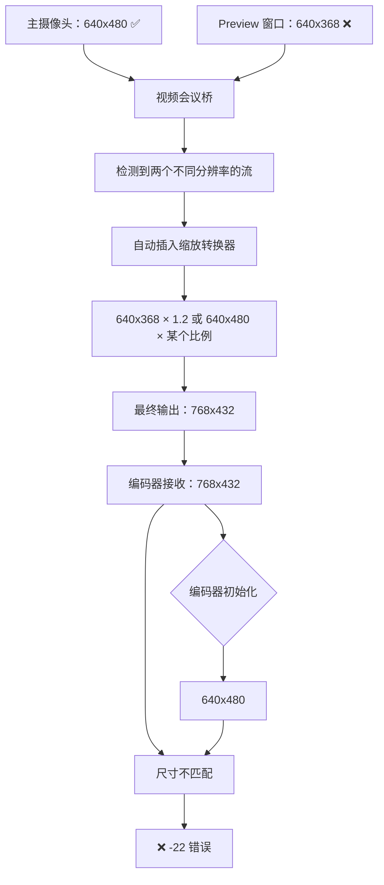

# Fix 100.33：修复 LocalVideoManager 中残留的 640x368 配置

**时间**: 2026-01-11 04:00
**问题**: Fix 100.32 测试失败，编码器仍然接收 768x432 帧
**根本原因**: LocalVideoManager.cpp 中 Preview 窗口仍使用 640x368 配置

## Fix 100.32 测试结果

### ✅ 摄像头成功打开为 640x480
```
09:48:16.862: [FIX 100.32] Forced camera resolution to 640x480@30fps (VGA, hardware-supported)
09:48:16.862: Opening device icspring camera: format=I420, size=640x480 @30:1 fps
09:48:17.001: Device icspring camera opened: format=I420, size=640x480 @30:1 fps
```

### ✅ 编码器成功初始化为 640x480
```
09:48:08.655: About to init enc_fmt: fmt_id=0x34363248, 640x480
[DEBUG] TX size: 640 x 480
[DEBUG] TX fps: 30 / 1
```

### ❌ 编码器仍然接收 768x432 帧
```
09:48:17.369: Frame format: 0 (I420), size: 768x432
09:48:17.369: [ENCODE] avcodec_send_frame() failed: -22 (Invalid argument)
```

## 根因分析：Preview 窗口使用旧分辨率

### 关键线索
```
09:48:17.095: Opening device icspring camera: format=YUY2, size=640x368 @25:1 fps
```

这是 Preview 窗口尝试打开摄像头，使用的是 **640x368 @ 25fps** 的旧配置！

### 完整问题链



**关键问题**：
1. 主摄像头成功打开为 640x480 ✅
2. Preview 窗口尝试打开 640x368 ❌
3. 视频会议桥检测到分辨率不匹配
4. 自动插入缩放转换器
5. 缩放后输出 768x432（可能是某种比例计算）
6. 编码器接收 768x432 但初始化为 640x480
7. 尺寸不匹配 → -22 错误

## 代码位置

### LocalVideoManager.cpp

**Line 142** - 渲染器视频格式：
```cpp
// ❌ 旧代码
pjmedia_format_init_video(&vp_param.vidparam.fmt, PJMEDIA_FORMAT_I420, 640, 368, 25, 1);
vp_param.vidparam.disp_size.w = 640;
vp_param.vidparam.disp_size.h = 368;
```

**Line 266** - 独立预览摄像头格式：
```cpp
// ❌ 旧代码
pjmedia_format_init_video(&param.format, PJMEDIA_FORMAT_YUY2, 640, 368, 25, 1);
qDebug() << "📹 Creating independent preview: 640x368 @ 25fps (YUY2), SDL window hidden";
```

## Fix 100.33 修改

### 修改 1：渲染器视频格式

**Line 142-145**:
```cpp
// ❌ 2026-01-11 01:45 [修复 100.29] 修改为 640x368（16像素对齐）
// ✅ 2026-01-11 04:00 [修复 100.33] 修改为 640x480 @ 30fps（摄像头硬件支持）
pjmedia_format_init_video(&vp_param.vidparam.fmt, PJMEDIA_FORMAT_I420, 640, 480, 30, 1);
vp_param.vidparam.disp_size.w = 640;
vp_param.vidparam.disp_size.h = 480;
```

### 修改 2：独立预览摄像头格式

**Line 267-270**:
```cpp
// ❌ 2026-01-11 01:45 [修复 100.29] 修改为 640x368（16像素对齐）
// ✅ 2026-01-11 04:00 [修复 100.33] 修改为 640x480 @ 30fps（摄像头硬件支持）
pjmedia_format_init_video(&param.format, PJMEDIA_FORMAT_YUY2, 640, 480, 30, 1);
param.show = PJ_FALSE;  // 隐藏SDL窗口

qDebug() << "📹 Creating independent preview: 640x480 @ 30fps (YUY2), SDL window hidden";
```

## 预期效果

### 修复后的流程
```
主摄像头打开：640x480 @ 30fps ✅
  ↓
Preview 窗口：640x480 @ 30fps ✅  (格式可能不同：YUY2 vs I420)
  ↓
视频会议桥检测：两个端口分辨率完全一致
  ↓
无需缩放，直接连接
  ↓
编码器接收：640x480 @ 30fps I420 ✅
  ↓
编码器初始化：640x480 @ 30fps H264 ✅
  ↓
✅ 尺寸完全匹配 → 成功编码 → 对方看到视频
```

### 日志验证点

**成功标志**:
```
✅ [FIX 100.32] Forced camera resolution to 640x480@30fps
Opening device ... format=I420, size=640x480 @30:1 fps
Device ... opened: format=I420, size=640x480 @30:1 fps
📹 Creating independent preview: 640x480 @ 30fps (YUY2), SDL window hidden
Frame format: 0 (I420), size: 640x480  ← 关键验证点
✅ [ENCODE] Frame encoded successfully
```

**失败标志** (如仍出现):
```
❌ Frame format: 0 (I420), size: 768x432  (仍然缩放)
❌ [ENCODE] avcodec_send_frame() failed: -22  (尺寸不匹配)
```

## 深度分析：为什么会有 768x432？

### 计算验证
- 768 ÷ 640 = 1.2
- 432 ÷ 360 = 1.2

768x432 = 640x360 × 1.2 倍

### 可能的缩放逻辑

**假设**：视频会议桥在处理多个不同分辨率的端口时，可能使用了某种比例计算。

**场景 1**：主摄像头 640x480，Preview 640x368
- 视频会议桥可能取某个中间值或计算出 768x432

**场景 2**：可能存在其他配置
- 可能有其他地方仍在使用 640x360 的旧值
- SDP 协商可能产生了某个中间分辨率

### 需要进一步调查（如 Fix 100.33 仍失败）

1. 搜索所有 `640` 和 `360` 的配置
2. 检查 SDP offer/answer 的实际分辨率
3. 查看视频会议桥的日志，了解缩放决策逻辑
4. 考虑禁用 Preview 窗口，只保留主摄像头流

## 修复历史

| Fix | 问题 | 修改 | 结果 |
|-----|------|------|------|
| 100.29 | 360 不是 16 倍数 | 360 → 368 | ❌ V4L2 不支持 |
| 100.30 | V4L2 fallback | 修改 codec descriptor | ❌ 仍 fallback |
| 100.31 | V4L2 fallback | 强制摄像头分辨率 | ❌ 仍 fallback |
| 100.32 | V4L2 不支持 368 | 使用硬件支持的 480 | ✅ 摄像头成功<br>❌ 编码器仍收 768x432 |
| **100.33** | **Preview 窗口用旧配置** | **LocalVideoManager → 480** | ⏳ **测试中** |

## 技术洞察

### 视频会议桥的复杂性

PJSIP 的视频会议桥（`pjmedia_vid_conf`）在检测到多个不同分辨率的端口时：
1. 自动插入格式转换器
2. 自动插入缩放转换器
3. 尝试找到一个"合适"的输出分辨率

**问题**：这个自动缩放逻辑可能不符合我们的预期，导致输出分辨率与编码器不匹配。

### 解决方法

确保所有进入视频会议桥的端口使用**完全相同的分辨率和帧率**：
- 主摄像头：640x480 @ 30fps
- Preview 渲染器：640x480 @ 30fps
- 编码器：640x480 @ 30fps

## 相关文档

- Fix 100.32：[07-Fix100.32-使用摄像头硬件支持的640x480分辨率.md](./07-Fix100.32-使用摄像头硬件支持的640x480分辨率.md)
- 根本原因：[05-对方看不到视频的根本原因分析.md](./05-对方看不到视频的根本原因分析.md)

## 测试计划

1. **编译部署**:
   ```powershell
   .\build-ubuntu24-apt.ps1 188
   ```

2. **关键验证**:
   - 查找日志中的 "Frame format"
   - 确认分辨率是否为 640x480（不是 768x432）
   - 确认编码成功（无 -22 错误）

3. **功能测试**:
   - 拨打 1006
   - 对方能否看到本地视频
