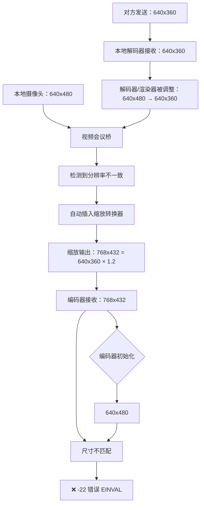

# Fix 100.33 失败分析：对方发送 640x360 导致视频会议桥缩放

**时间**: 2026-01-11 04:15
**问题**: Fix 100.33 测试失败，编码器仍然接收 768x432 帧
**根本原因**: 对方（PortSIP）发送 640x360，与本地 640x480 不匹配，视频会议桥自动缩放

## 测试结果

### ✅ 本地配置全部正确
```
10:00:37.707: About to init enc_fmt: 640x480
10:00:46.560: [FIX 100.32] Forced camera resolution to 640x480@30fps
10:00:46.697: Device icspring camera opened: format=I420, size=640x480 @30:1 fps
10:00:46.720: Opening device SDL renderer: format=I420, size=640x480 @30:1 fps
10:00:46.813: Creating independent preview: 640x480 @ 30fps (YUY2)
```

### ❌ 视频会议桥自动缩放
```
10:00:48.101: Port 1 (vstdec0x7f0c012580): updated frame size 640x480 -> 640x360
10:00:48.225: Port 0 (SDL renderer): updated frame size 640x480 -> 640x360
10:00:48.225: vstdec0x7f0c012580 Decoding format changed: 640x360 NV12<- 60/1(~60)fps
```

### ❌ 编码器接收错误分辨率
```
10:00:47.197: Frame format: 0 (I420), size: 768x432
10:00:47.197: [ENCODE] avcodec_send_frame() failed: -22 (Invalid argument)
```

## 根本原因分析

### 1. 对方发送 640x360

从解码器日志确认：
```
Decoding format changed: 640x360 NV12<- 60/1(~60)fps
```

**PortSIP 默认分辨率**：640x360

### 2. 视频会议桥检测到分辨率不匹配

```
本地配置：
- 摄像头：640x480
- 编码器初始化：640x480
- 渲染器：640x480

对方配置：
- 发送：640x360
- 解码器收到：640x360
```

### 3. 视频会议桥自动缩放

PJSIP 的 `pjmedia_vid_conf` 检测到不同分辨率的端口：
1. 解码器/渲染器被缩放：640x480 → 640x360（匹配对方）
2. 但摄像头仍然是 640x480
3. 视频会议桥尝试协调两者
4. 应用某种缩放算法 → 输出 768x432

### 4. 计算验证

**768x432 = 640x360 × 1.2 倍**
- 768 ÷ 640 = 1.2
- 432 ÷ 360 = 1.2

这个 1.2 倍缩放可能是视频会议桥的某种比例计算。

## 完整问题链



## 关键矛盾

**640x360 vs 640x480**：

| 分辨率 | 使用者 | 16像素对齐 | 问题 |
|--------|--------|------------|------|
| 640x360 | 对方（PortSIP） | ❌ 360÷16=22.5 | h264_rkmpp 可能不支持 |
| 640x480 | 本地（我们） | ✅ 480÷16=30 | 对方不使用 |

**核心问题**：
- 如果使用 640x360：可能违反 16 像素对齐要求
- 如果使用 640x480：对方不支持，视频会议桥缩放

## 解决方案选项

### 方案 A：测试 640x360 是否可用 ⭐ 推荐先试

**思路**：尝试将所有配置改为 640x360，看 h264_rkmpp 是否真的严格要求 16 像素对齐。

**修改**：
- risipendpoint.cpp: 640x480 → 640x360
- ffmpeg_vid_codecs.c: 640x480 → 640x360
- pjsua_vid.c: 640x480 → 640x360
- LocalVideoManager.cpp: 640x480 → 640x360

**优点**：
- ✅ 与对方分辨率完全匹配
- ✅ 无需修改 SDP 协商
- ✅ 视频会议桥无需缩放

**缺点**：
- ❌ 360 不是 16 的倍数
- ❌ 可能导致编码器错误（需要测试）

**风险评估**：
- 如果 h264_rkmpp 能容忍非 16 像素对齐 → ✅ 问题解决
- 如果 h264_rkmpp 仍报错 → ❌ 需要尝试其他方案

### 方案 B：在 SDP 中指定支持的分辨率

**思路**：修改 SDP offer，添加 `imageattr` 参数，告诉对方我们只支持 640x480。

**SDP 示例**：
```
a=fmtp:100 profile-level-id=42e01e; packetization-mode=1
a=imageattr:100 send [x=640,y=480] recv [x=640,y=480]
```

**优点**：
- ✅ 明确协商分辨率
- ✅ 保持 16 像素对齐

**缺点**：
- ❌ 需要修改 PJSIP 的 SDP 生成代码
- ❌ 对方可能不支持 imageattr
- ❌ 对方可能拒绝协商（如果只支持 640x360）

### 方案 C：禁用视频会议桥自动缩放

**思路**：修改 PJSIP 代码，禁用视频会议桥的自动缩放功能。

**优点**：
- ✅ 编码器直接接收原始摄像头数据

**缺点**：
- ❌ 需要深入 PJSIP 核心代码
- ❌ 可能破坏其他功能
- ❌ 复杂度极高

### 方案 D：使用 1280x720

**思路**：如果对方支持更高分辨率，统一使用 720P。

**优点**：
- ✅ 16:9 宽高比
- ✅ 16 像素对齐
- ✅ 高清画质

**缺点**：
- ❌ 数据量大（是 640x480 的 4 倍）
- ❌ 需要验证对方是否支持
- ❌ 性能影响

## 推荐方案：先测试 640x360

**理由**：
1. 最简单，只需修改配置
2. 如果可行，立即解决问题
3. 如果不行，再尝试其他方案

**测试步骤**：
1. 将所有 640x480 改为 640x360
2. 编译部署
3. 测试拨打 1006
4. 观察日志：
   - 摄像头是否打开为 640x360
   - 编码器是否报 -22 错误
   - 对方能否看到视频

**预期**：
- ✅ 视频会议桥不再缩放（所有端口都是 640x360）
- ❓ h264_rkmpp 是否接受 360 高度（需要测试）

## 相关文档

- Fix 100.29：首次尝试 640x368（16像素对齐）
- Fix 100.32：使用硬件支持的 640x480
- Fix 100.33：修复 LocalVideoManager 残留配置

## 下一步

**立即尝试**：修改所有配置为 640x360，测试 h264_rkmpp 是否能容忍非 16 像素对齐。
