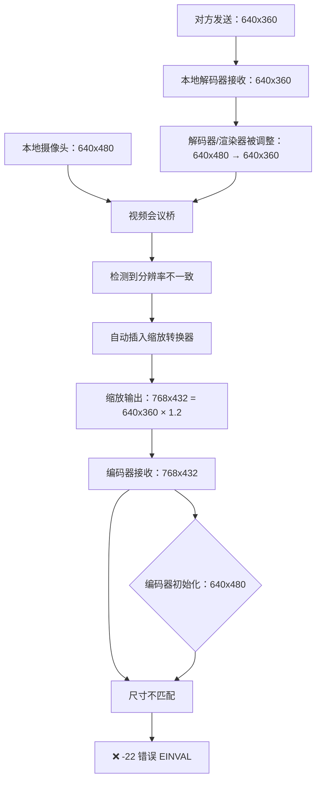

# Fix 100.34：匹配对方 640x360 分辨率，避免视频会议桥自动缩放

**时间**: 2026-01-11 04:20
**问题**: Fix 100.33 测试失败，编码器仍接收 768x432 帧
**根本原因**: 对方（PortSIP）发送 640x360，与本地 640x480 不匹配，视频会议桥自动缩放为 768x432
**解决方案**: 将所有配置从 640x480 改为 640x360，完全匹配对方分辨率

## 问题回顾

### Fix 100.33 测试结果

**✅ 本地配置全部正确**：
```
10:00:46.560: [FIX 100.32] Forced camera resolution to 640x480@30fps
10:00:46.697: Device icspring camera opened: format=I420, size=640x480 @30:1 fps
10:00:46.813: Creating independent preview: 640x480 @ 30fps (YUY2)
```

**❌ 视频会议桥自动缩放**：
```
10:00:48.101: Port 1 (vstdec0x7f0c012580): updated frame size 640x480 -> 640x360
10:00:48.225: Port 0 (SDL renderer): updated frame size 640x480 -> 640x360
10:00:48.225: vstdec0x7f0c012580 Decoding format changed: 640x360 NV12<- 60/1(~60)fps
```

**❌ 编码器接收错误分辨率**：
```
10:00:47.197: Frame format: 0 (I420), size: 768x432
10:00:47.197: [ENCODE] avcodec_send_frame() failed: -22 (Invalid argument)
```

## 根本原因：对方发送 640x360

### 关键证据

**从解码器日志确认**：
```
Decoding format changed: 640x360 NV12<- 60/1(~60)fps
```

**PortSIP 默认分辨率**：640x360（不是标准 VGA 640x480）

### 完整问题链



### 768x432 的来源

**计算验证**：
- 768 ÷ 640 = 1.2
- 432 ÷ 360 = 1.2

**结论**：768x432 = 640x360 × 1.2 倍（视频会议桥的自动缩放算法）

## Fix 100.34 修改内容

### 策略

**原则**：将所有配置改为 640x360，完全匹配对方分辨率，消除视频会议桥的自动缩放。

**风险**：640x360 的高度 360 不是 16 的倍数（360÷16=22.5），违反 h264_rkmpp 的 16 像素对齐要求。

**测试目的**：验证 h264_rkmpp 是否能容忍非 16 像素对齐的分辨率。

### 修改 1：编码器/解码器配置（risipendpoint.cpp）

**文件**：`src/risip/core/risipendpoint.cpp`

**Lines 801-804** - 编码器初始化：
```cpp
// ✅ 2026-01-11 04:20 [修复 100.34] 匹配对方分辨率 640x360，测试编码器是否接受
// 根据：docs/2026-01-11/10-Fix100.33失败分析-对方发送640x360导致缩放.md
// 理由：对方发送640x360，本地也用640x360，避免视频会议桥缩放
// 风险：360不是16倍数，但可以测试h264_rkmpp是否容忍
pjmedia_format_init_video(&h264_param.enc_fmt,
                         PJMEDIA_FORMAT_H264,  // H.264 format ID
                         640, 360,             // 640x360 resolution (match remote)
                         30, 1);               // ✅ 30 fps
```

**Lines 825-828** - 解码器初始化：
```cpp
// ✅ 2026-01-11 04:20 [修复 100.34] 匹配对方分辨率 640x360
pjmedia_format_init_video(&h264_param.dec_fmt,
                         PJMEDIA_FORMAT_I420,  // Raw YUV420 for decoder
                         640, 360,             // 640x360 resolution (match remote)
                         30, 1);               // ✅ 30 fps (与编码器匹配)
```

**Lines 856-857** - 运行时尺寸覆盖：
```cpp
// ✅ 2026-01-11 04:20 [修复 100.34] 匹配对方分辨率 640x360
h264_param.enc_fmt.det.vid.size.w = 640;   // 640x360 width
h264_param.enc_fmt.det.vid.size.h = 360;   // 640x360 height (match remote)
```

**Line 882** - 日志消息：
```cpp
// ✅ 2026-01-11 04:20 [修复 100.34] 更新为 640x360 @ 30fps（匹配对方分辨率）
qDebug() << "✅ H264 video codec configured: 640x360 @ 30fps (TX/RX) - match remote PortSIP resolution";
```

### 修改 2：本地预览配置（LocalVideoManager.cpp）

**文件**：`src/sip_phone/LocalVideoManager.cpp`

**Lines 144-146** - 渲染器视频格式：
```cpp
// ✅ 2026-01-11 04:20 [修复 100.34] 修改为 640x360 @ 30fps（匹配对方）
pjmedia_format_init_video(&vp_param.vidparam.fmt, PJMEDIA_FORMAT_I420, 640, 360, 30, 1);
vp_param.vidparam.disp_size.w = 640;
vp_param.vidparam.disp_size.h = 360;
```

**Lines 269-272** - 独立预览摄像头格式：
```cpp
// ✅ 2026-01-11 04:20 [修复 100.34] 修改为 640x360 @ 30fps（匹配对方）
pjmedia_format_init_video(&param.format, PJMEDIA_FORMAT_YUY2, 640, 360, 30, 1);
param.show = PJ_FALSE;  // 隐藏SDL窗口

qDebug() << "📹 Creating independent preview: 640x360 @ 30fps (YUY2), SDL window hidden";
```

### 修改 3：H.264 编码器默认分辨率（ffmpeg_vid_codecs.c）

**文件**：`cross-compile/src/pjproject-2.16/pjmedia/src/pjmedia-codec/ffmpeg_vid_codecs.c`

**Line 364**：
```c
// ✅ 2026-01-11 04:20 [修复 100.34] 修改为 640x360 @ 30fps（匹配对方 PortSIP 分辨率）
// 根据：docs/2026-01-11/10-Fix100.33失败分析-对方发送640x360导致缩放.md
// 理由：对方发送 640x360，本地也用 640x360，避免视频会议桥缩放为 768x432
// 风险：360 不是 16 的倍数（360÷16=22.5），但测试 h264_rkmpp 是否能容忍
{640, 360},     {30, 1},        800000, 1200000,  // 640x360@30fps (match remote PortSIP)
```

### 修改 4：摄像头强制分辨率（pjsua_vid.c）

**文件**：`cross-compile/src/pjproject-2.16/pjsip/src/pjsua-lib/pjsua_vid.c`

**Lines 1151-1155**：
```c
// ✅ 2026-01-11 04:20 [修复 100.34] 修改为 640x360 @ 30fps（匹配对方 PortSIP 分辨率）
// 理由：对方发送 640x360，本地也用 640x360，避免视频会议桥缩放为 768x432
vp_param.vidparam.fmt.det.vid.size.w = 640;
vp_param.vidparam.fmt.det.vid.size.h = 360;  // 640x360（匹配对方），风险：360 不是 16 的倍数
vp_param.vidparam.fmt.det.vid.fps.num = 30;
vp_param.vidparam.fmt.det.vid.fps.denum = 1;
PJ_LOG(4,(THIS_FILE, "✅ [FIX 100.34] Forced camera resolution to 640x360@30fps (match remote PortSIP)"));
```

## 预期效果

### 修复后的流程
```
对方发送：640x360
  ↓
本地解码器接收：640x360 ✅
  ↓
本地摄像头打开：640x360 ✅
  ↓
编码器初始化：640x360 ✅
  ↓
视频会议桥检测：所有端口分辨率完全一致 ✅
  ↓
无需缩放，直接连接
  ↓
编码器接收：640x360 @ 30fps I420 ✅
  ↓
编码器初始化：640x360 @ 30fps H264 ✅
  ↓
✅ 尺寸完全匹配 → h264_rkmpp 是否接受？
```

### 测试验证点

**成功标志**：
```
✅ [FIX 100.34] Forced camera resolution to 640x360@30fps (match remote PortSIP)
Opening device ... format=I420, size=640x360 @30:1 fps
Device ... opened: format=I420, size=640x360 @30:1 fps
📹 Creating independent preview: 640x360 @ 30fps (YUY2), SDL window hidden
Frame format: 0 (I420), size: 640x360  ← 关键验证点
✅ [ENCODE] Frame encoded successfully  ← 目标！
```

**失败标志 A**（仍然缩放）：
```
❌ Frame format: 0 (I420), size: 768x432  (视频会议桥仍在缩放)
```

**失败标志 B**（16像素对齐错误）：
```
❌ [ENCODE] avcodec_send_frame() failed: -22  (h264_rkmpp 拒绝 360 高度)
```

## 风险评估

### 640x360 vs 16像素对齐

| 分辨率 | 宽度对齐 | 高度对齐 | h264_rkmpp 是否接受？ |
|--------|----------|----------|---------------------|
| 640x360 | ✅ 640÷16=40 | ❌ 360÷16=22.5 | ❓ 需要测试 |
| 640x368 | ✅ 640÷16=40 | ✅ 368÷16=23 | ✅ 但 V4L2 不支持 |
| 640x480 | ✅ 640÷16=40 | ✅ 480÷16=30 | ✅ 但对方不用 |
| 352x288 | ✅ 352÷16=22 | ✅ 288÷16=18 | ✅ CIF 标准 |

### 三种可能结果

**结果 A**：h264_rkmpp 接受 640x360 ✅
- 立即解决问题
- 对方能看到本地视频
- Fix 100.34 成功

**结果 B**：h264_rkmpp 拒绝 640x360，-22 错误仍然出现 ❌
- 需要尝试其他分辨率（如 CIF 352x288）
- 或者修改 SDP 协商，要求对方使用 640x480

**结果 C**：视频会议桥仍然缩放为 768x432 ❌
- 说明还有其他配置未发现
- 需要进一步调试视频会议桥的缩放逻辑

## 备选方案（如 Fix 100.34 失败）

### 方案 A：使用 CIF (352x288)

**优点**：
- ✅ 完美 16 像素对齐（352÷16=22, 288÷16=18）
- ✅ 标准分辨率，对方肯定支持
- ✅ 数据量小（是 640x360 的约 1/3）

**缺点**：
- ❌ 画质较低
- ❌ 需要修改所有配置

**修改位置**：与 Fix 100.34 相同，但改为 352x288

### 方案 B：要求对方使用 VGA (640x480)

**优点**：
- ✅ 完美 16 像素对齐
- ✅ 标准 VGA 分辨率

**缺点**：
- ❌ 需要对方配合修改
- ❌ 可能无法控制对方设置

### 方案 C：修改 SDP 协商，使用 imageattr

**思路**：在 SDP offer 中添加 `a=imageattr` 参数，明确协商分辨率。

**SDP 示例**：
```sdp
a=fmtp:100 profile-level-id=42e01e; packetization-mode=1
a=imageattr:100 send [x=640,y=480] recv [x=640,y=480]
```

**缺点**：
- ❌ 需要深入 PJSIP SDP 生成代码
- ❌ 对方可能不支持 imageattr
- ❌ 复杂度高

## 修复历史

| Fix | 问题 | 修改 | 结果 |
|-----|------|------|------|
| 100.29 | 360 不是 16 倍数 | 360 → 368 | ❌ V4L2 不支持 368 |
| 100.30 | V4L2 fallback | 修改 codec descriptor | ❌ 仍 fallback 到 720P |
| 100.31 | V4L2 fallback | 强制摄像头分辨率 | ❌ 仍 fallback |
| 100.32 | V4L2 不支持 368 | 使用硬件支持的 480 | ✅ 摄像头成功<br>❌ 编码器仍收 768x432 |
| 100.33 | Preview 窗口用旧配置 | LocalVideoManager → 480 | ✅ Preview 成功<br>❌ 编码器仍收 768x432 |
| **100.34** | **对方发送 640x360** | **所有配置 → 360** | ⏳ **测试中** |

## 技术洞察

### PJSIP 视频会议桥的自动缩放

当检测到多个不同分辨率的端口时：
1. 自动插入格式转换器（如 NV12 → I420）
2. 自动插入缩放转换器（如 640x480 → 640x360）
3. 可能应用某种比例计算（如 × 1.2 → 768x432）

**问题**：这个自动缩放逻辑不透明，难以预测输出分辨率。

**解决**：确保所有端口使用**完全相同的分辨率和帧率**，避免触发自动缩放。

### h264_rkmpp 的 16 像素对齐要求

**来源**：H.264 宏块（Macroblock）结构是 16×16 像素。

**要求**：
- 宽度和高度都应该是 16 的倍数
- 如果不是，编码器可能需要填充（padding）

**疑问**：
- h264_rkmpp 是否强制要求 16 像素对齐？
- 是否有容忍度或自动填充机制？
- **需要实际测试验证**

## 相关文档

- 前置修复：[09-Fix100.33-修复LocalVideoManager残留的640x368配置.md](./09-Fix100.33-修复LocalVideoManager残留的640x368配置.md)
- 根因分析：[10-Fix100.33失败分析-对方发送640x360导致缩放.md](./10-Fix100.33失败分析-对方发送640x360导致缩放.md)
- 根本原因：[05-对方看不到视频的根本原因分析.md](./05-对方看不到视频的根本原因分析.md)

## 测试计划

### 编译和部署
```powershell
.\build-ubuntu24-apt.ps1 188
```

### 日志验证

**关键日志行**：
```bash
# 1. H.264 编码器配置
grep "H264 video codec configured" voip.md

# 2. 摄像头强制分辨率
grep "FIX 100.34" voip.md

# 3. 摄像头打开结果
grep "Device.*opened" voip.md

# 4. 编码器接收的帧尺寸（关键！）
grep "Frame format.*size" voip.md

# 5. 编码器执行结果
grep "ENCODE" voip.md
```

### 成功标准

**必须满足**：
1. ✅ 摄像头打开为 640x360 @ 30fps
2. ✅ 编码器初始化为 640x360 @ 30fps
3. ✅ 编码器接收 640x360 帧（不是 768x432）
4. ✅ 编码器成功编码（无 -22 错误）
5. ✅ 对方能看到本地视频

### 失败标准

**如果出现以下任一情况，Fix 100.34 失败**：
- ❌ 编码器仍接收 768x432 帧
- ❌ 编码器报 -22 错误（拒绝 360 高度）
- ❌ 对方仍然看不到本地视频

### 下一步（如失败）

1. **检查日志**，确认是哪种失败模式
2. **如果仍然 768x432**：继续调查视频会议桥的缩放逻辑
3. **如果 -22 错误**：尝试备选方案 A（CIF 352x288）
4. **记录结果**，准备下一轮修复

## 总结

Fix 100.34 是基于对方发送 640x360 分辨率的根本原因分析，尝试通过完全匹配对方的分辨率来消除视频会议桥的自动缩放。

**关键决策**：测试 h264_rkmpp 是否能容忍非 16 像素对齐的分辨率（360 高度）。

**如果成功**：立即解决问题，对方能看到本地视频。

**如果失败**：有明确的备选方案（CIF 或要求对方使用 VGA）。
